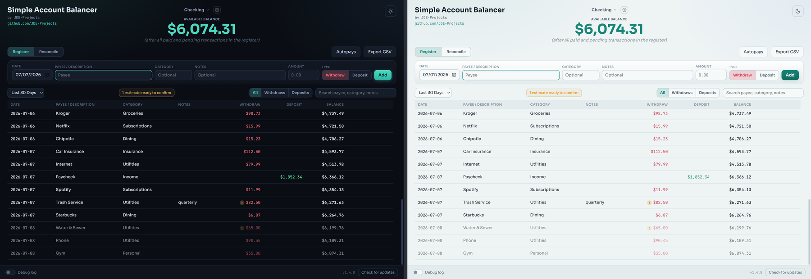

# Simple Account Balancer

A checkbook register app: you log every debit and credit the moment it
happens, so the register is ahead of the bank and is the real answer to "how
much money do I actually have." For anyone who kept a check register or a
balance spreadsheet.

Built by [JDE-Projects](https://github.com/JDE-Projects).

If you enjoyed this project and would like to buy me a coffee, check out my [Ko-fi](https://ko-fi.com/jdeprojects).

## Preview

<p align="center">
  
  <br><em>Dark and light themes</em>
</p>

## Highlights
- Today's balance front and center in the header, next to the active account
  name; recalculates automatically for out-of-order or backdated entries, with
  an "After upcoming" line whenever future-dated entries exist.
- Quick entry with payee autocomplete and freely editable categories.
- Autopays: catalog a recurring bill or deposit once and the app posts it to
  the register automatically each month, appearing on the day you choose and
  shown dimmed until its date arrives.
- Search, filtering, and shared date-range views (Last 7/14/30/90 days, or a
  custom range).
- Reconcile view with cleared checkboxes and a discrepancy finder that hunts
  down the amount you're off by.
- Multiple accounts with a simple switcher.
- CSV export for any date range.
- Automatic rolling backups on launch and exit; backups live next to the
  app by default, or in any folder you choose.
- Local only - your data never leaves the machine.
- Checks GitHub Releases for a newer version (at startup and on demand; silent when offline).

## How it works
- Storage: a single SQLite database (`simple_account_balancer.db`) next to
  the exe, via the Python standard library. Money is stored as integer
  cents, never floats.
- Window: pywebview on the Qt backend (PySide6), UI in
  `simple_account_balancer-UI.html`.

## Download and run
Two ways to get it from the Releases page - pick one:
- **Installer (recommended):** download `SimpleAccountBalancer-vX.Y.Z-setup.exe` and
  run it. Installs the app, adds a Start menu shortcut, and can be removed later
  from Add or Remove Programs. Installs just for you by default (no admin); you can
  choose all users during setup.
- **Portable .zip:** download `SimpleAccountBalancer-vX.Y.Z.zip`, extract it, and run
  `Simple Account Balancer.exe` from inside the extracted folder. No install - good for
  a locked-down PC or a USB stick. Keep the folder together.
Windows only, no Python or setup required. Unsigned, so SmartScreen may warn the
first time: More info > Run anyway.

## Verify this download (optional)
This release was built on GitHub from this public source - not on a personal
machine - and is signed with a build-provenance attestation. To confirm a
download is genuine, install the [GitHub CLI](https://cli.github.com) and run:

```
gh attestation verify SimpleAccountBalancer-vX.Y.Z.zip \
  --repo JDE-Projects/Simple-Account-Balancer \
  --signer-repo JDE-Projects/Build-Tools
```

A `Verification succeeded!` line means the file was built by the published
pipeline from this repo. You can also check the file against the published
`.sha256`.

## Updating

Simple Account Balancer doesn't update itself. The bottom bar has a **Check for updates** button that tells you when a newer release is out; when it does, get the new version from the [Releases](../../releases) page the same way you first installed it.

- **Installer:** download the new `SimpleAccountBalancer-vX.Y.Z-setup.exe` and run it. It installs over your current copy and keeps your database, backups, and settings.
- **Portable .zip:** download and extract the new `SimpleAccountBalancer-vX.Y.Z.zip`. Copy `simple_account_balancer.db`, the `backups` folder, and `simple_account_balancer.pref` from the old folder into the new one to keep your data and settings.

There are no stored secrets, so that's all you need to carry over.

## Build from source (optional)
- Python 3 on PATH.
- `pip install -r requirements.txt` (pinned `pywebview`, `PySide6`, `qtpy`,
  `pyinstaller`; keep PyQt6 uninstalled so the LGPL binding is the one bundled).
- Keep `simple_account_balancer.py`, `simple_account_balancer-UI.html`, the
  `fonts/` folder, the `.ico`, `.png`, and `-splash.png` together.
- Run from source: `python simple_account_balancer.py`
- Build the .exe: `Build_Simple_Account_Balancer.bat` -> `dist\Simple Account Balancer\Simple Account Balancer.exe`

## Using it
1. On first launch, enter an account name and your starting balance as of a
   given date.
2. Log each debit or credit as it happens: date, payee, an optional category
   and notes, and the amount.
3. The header always shows your real, up-to-date balance.
4. For recurring bills and deposits, open **Autopays** in the register view
   and add each one once: what it pays, the day it should appear in the
   register, and the day it pays. The app enters them for you from then on.
5. Use the Reconcile tab to check entries off against your bank statement.
   If the numbers disagree, type the difference into the discrepancy finder
   to help track it down.
6. Export any date range to CSV from the Export CSV button in the register view.

## Security and privacy
- Everything stays in the SQLite file next to the exe.
- No accounts, cloud, telemetry, or bank connections, ever.
- The only network call is the version check against GitHub Releases.
- Optional debug log, off by default. When on, it writes
  `Debug_Log_MMDDYYYY_HHMMSS.txt` next to the app. It records actions and
  errors only, never payees, amounts, or balances, so it is safe to attach
  to a bug report.

## A note on how this was built
This project was built with AI assistance. The design decisions, feature
direction, and real-world testing were directed by me. The code was written
and revised with an AI assistant against that direction.

## License
Released under the PolyForm Noncommercial License 1.0.0 (see [LICENSE](LICENSE)).
Personal and noncommercial use, modification, and noncommercial redistribution
are permitted; commercial use is not. Keep the copyright notice; no warranty.
This tool bundles third-party code; see
[THIRD-PARTY-LICENSES.txt](THIRD-PARTY-LICENSES.txt).

For commercial licensing, open a [GitHub issue](https://github.com/JDE-Projects/Simple-Account-Balancer/issues) with the title "Commercial License Inquiry".
